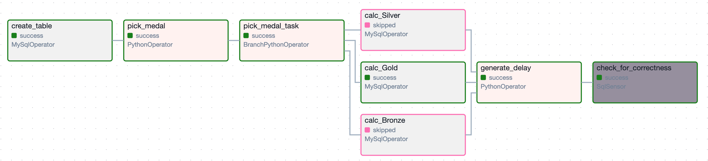
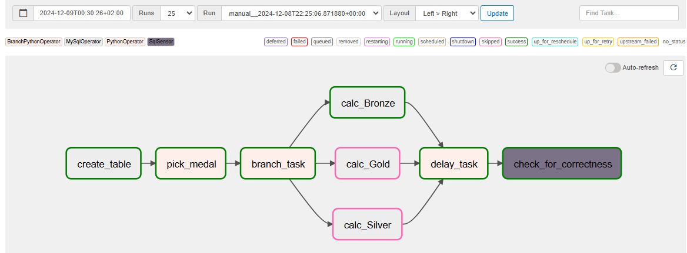
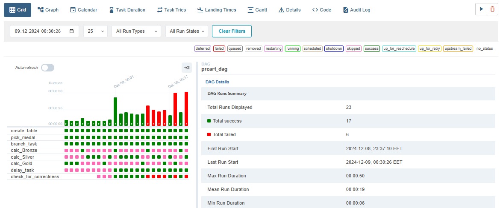
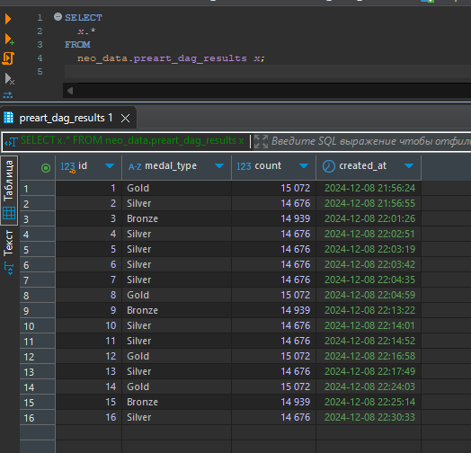

# goit-de-hw-07. Apache Airflow

## Завдання

**Реалізувати DAG із використанням вивчених операторів, щоб виконати певний перелік прикладних завдань**.

**Покрокова інструкція виконання**

Напишіть DAG, що має такі завдання (кожен пункт → одне завдання/task):  

1. Створює таблицю.

   👉🏻 Використайте IF NOT EXISTS з полями id (автоінкремент, головний ключ), medal_type, count, created_at.

2. Випадково обирає одне із трьох значень ['`Bronze`', '`Silver`', '`Gold`'].

3. Залежно від обраного значення запускає одне із трьох завдань (розгалуження).

4. Опис трьох завдань:

1) Завдання рахує кількість записів у таблиці `olympic_dataset.athlete_event_results`, що містять запис `Bronze` у полі `medal`, та записує отримане значення в таблицю, створену в пункті 1, разом із типом медалі та часом створення запису.

2) Завдання рахує кількість записів у таблиці `olympic_dataset.athlete_event_results`, що містять запис `Silver` у полі `medal`, та записує отримане значення в таблицю, створену в пункті 1, разом із типом медалі та часом створення запису.

3) Завдання рахує кількість записів у таблиці `olympic_dataset.athlete_event_results`, що містять запис `Gold` у полі `medal`, та записує отримане значення в таблицю, створену в пункті 1, разом із типом медалі та часом створення запису.

5. Запускає затримку виконання наступного завдання.

   👉🏻 Використайте PythonOperaor із функцією time.sleep(n), якщо одне з трьох попередніх завдань виконано успішно.

6. Перевіряє за допомогою сенсора, чи найновіший запис у таблиці, створеній на етапі 1, не старший за 30 секунд (порівнюючи з поточним часом). Ідея в тому, щоб упевнитися, чи справді відбувся запис у таблицю.

   👉🏻 За допомогою задачі затримки на етапі 5 ви можете створити затримку 35 секунд для того, щоб упевнитися, що сенсор справді «падає», якщо затримка більша за 30 секунд.

## Рішення

Налаштування контейнера для Docker:  
[Initializing Environment](https://airflow.apache.org/docs/apache-airflow/stable/howto/docker-compose/index.html#initializing-environment)

Код DAG [preart_dag.py](dags/preart_dag.py)

Зображення графу у Airflow UI:

Скрин Airflow UI із демонстрацією статусів:

- `success` (затримка <= контрольного часу в SQL-сенсорі)
- `failed` (затримка > контрольного часу в SQL-сенсорі)

Скрин таблиці `preart_dag_results` із заповненими результатами:  

